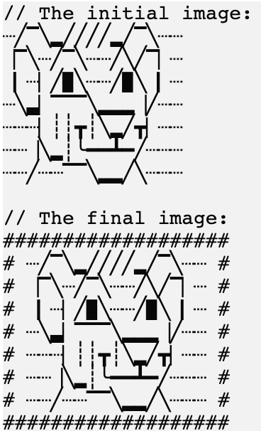
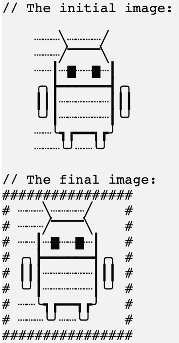
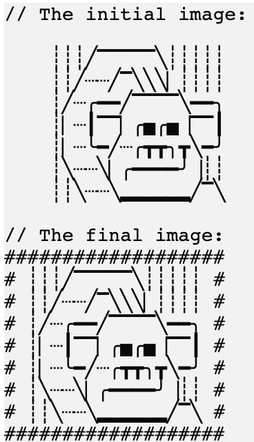

In this task, we will implement one of the filters.

### Task

Implement the `applyBordersFilter` function. 
For the border symbol, please use the predefined variable `borderSymbol`, which stores `#`:
```kotlin
println(borderSymbol) // #
```

<div class="hint" title="Click me to see an example of the applyBordersFilter function's work">

Here's an example of the function's work:
<p>
    
</p>
</div>


To make the picture prettier, add a separator between the picture and the border.
For the separator, please use the predefined variable `separator`, which stores a space.
```kotlin
println("This is the value from the separator variable: $separator.") // This is the value from the separator variable:  .
```

**Note that the picture might not be a square, which means the width of different lines in the picture can vary.**
In other words, you need to pad the shorter lines with the `separator` to make the image square.
To get the width of the picture, you can use the predefined function `getPictureWidth`, 
which returns the maximum length of all picture lines.

<div class="hint" title="Click me to see an example of the getPictureWidth function's work">

```kotlin
val pictureWidth = getPictureWidth(picture) // calculate the longest line in the picture and returns its length
```

In addition, the project already stores the `newLineSymbol` variable, which can be used to add new lines between newly generated picture lines, e.g.:
```kotlin
val line1 = "#######"
val line2 = "#######"

val line3 = "$line1$newLineSymbol$line2"
println(line3)
```

The result will be:
```text
#######
#######
```
</div>


If you have any difficulties, **hints will help you solve this task**.

----

### Hints

<div class="hint" title="Click me to see several examples of how the applyBordersFilter function should work">

First example:


Second example:


</div>

<div class="hint" title="Click me to learn how to run the applyBordersFilter function with predefined pictures">

To check how your function works, you can run it in <code>main</code> by passing one of the predefined pictures:

```kotlin
fun main() {
  applyFilter(simba, "borders")   // an example with the simba picture
  applyFilter(monkey, "borders")  // an example with the monkey picture
  applyFilter(android, "borders") // an example with the android picture (this picture has different line lengths)
}
```
</div>

<div class="hint" title="Click me to get a hint on how to calculate the length of the top and bottom edges for the new picture">

The length of the top and bottom edges of the border will be 4 characters longer than the width of the initial picture, 
since we add the <code>borderSymbol</code> and the <code>separator</code> on both sides of the image.
</div>


<div class="hint" title="Click me to learn how to implement the getPictureWidth function on your own">

  If you want, you can try to implement your own version of the `getPictureWidth` function: 
  split the picture using the <a href="https://kotlinlang.org/api/latest/jvm/stdlib/kotlin.text/lines.html">`lines`</a> function 
  and then use the <a href="https://kotlinlang.org/api/latest/jvm/stdlib/kotlin.text/max-of-or-null.html">`maxOfOrNull`</a> function to calculate 
  the maximum length of the picture lines.   
</div>

