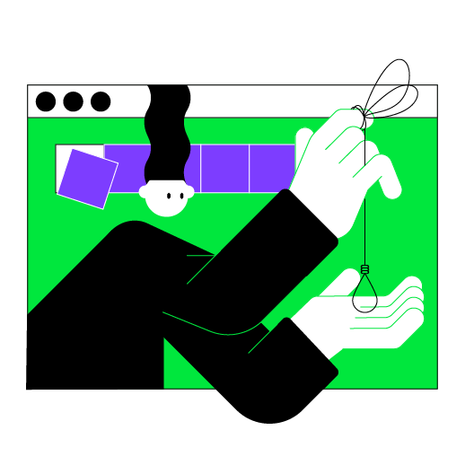

This lesson focuses on the topics that you covered in the previous lesson.
The main difference is that the final project will not be divided into intermediate stages
and you can try to implement it yourself from scratch.
We have no doubt that you will succeed!

----

    

### Project description

The project of this lesson is **Hangman**.
The purpose of this game is to guess the word chosen by the computer.
You can try to implement the whole game yourself; however, if you need help, 
refer to the hints.

### Project example

