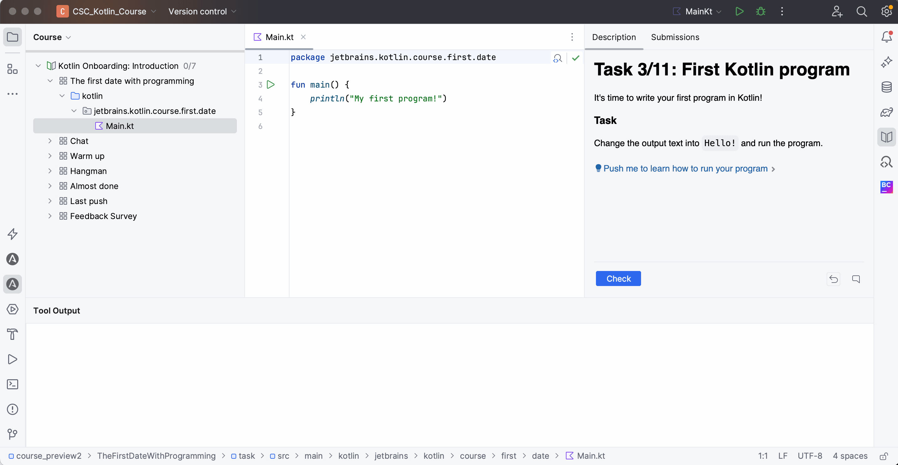

It's time to write your first program in Kotlin!

### Task

Change the output text into `Hello!` and run the program.

To run your program, you need to open the `Main.kt` file and click on the **green triangle** near the `main` function.
Then, the output of the program will be shown in the console:

